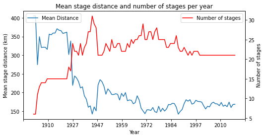
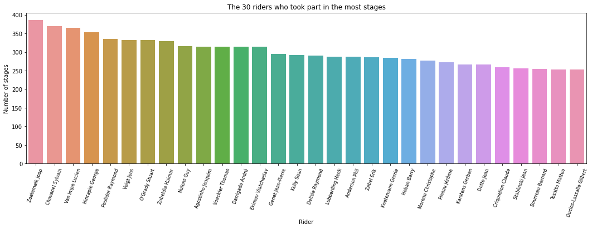
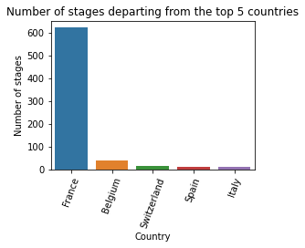
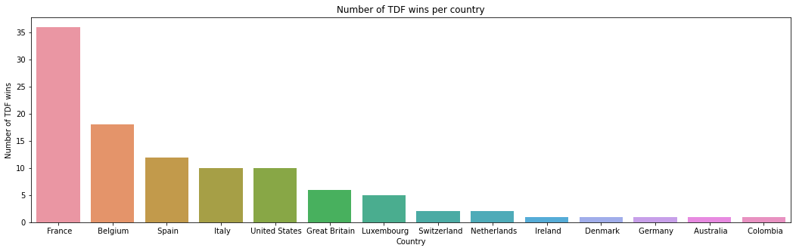

# Milestone 1

## Dataset

This visualization will be about the Tour de France, a bike race held once every year. It is structured as a stage race with 21 day-long stages over the course of 23 days. Each of these stages has its own ranking, as if they were individual races. The time taken by each rider for each of these stages is also added up to form the general classification. This decides the race's overall winner. There are also other awards and general classifications, which are detailed on [Wikipedia](https://en.wikipedia.org/wiki/Tour_de_France#Classifications).

Our data comes from two datasets. [LeTourDataSet](https://github.com/camminady/LeTourDataSet) and [TidyTuesday](https://github.com/rfordatascience/tidytuesday/blob/master/data/2020/2020-04-07/readme.md), which takes it's data in part from [Alastair Rushworth's github](https://github.com/alastairrushworth/tdf). They contain complementary information and can easily be joined to create the data we will use for our project.

We have complete data for the editions from 1903 to 2017, but only partial data for the races held from 2018 to 2021. The missing data could be completed without too much effort by using websites such as [procyclingstats](https://www.procyclingstats.com/) or [the official Tour de France website](https://www.letour.fr/en/history).

The data we will use is quite extensive. It contains, in summary, information about the winners of each year (as well as various information on them), the general classification, the results of each stage as well as what those stages were. Despite this extensiveness, we are missing the winners of the different general classifications other than the main one.

Overall, our data is clean and does not require extensive pre-processing. The missing data for the last few years is an issue, though, but one which can be resolved by either completing it or simply focusing on the years where our data is complete.

## Problematic

The Tour de France is an iconic sporting event that has been held every year since 1903, except during the two World Wars. It is one of the planet's major sporting events. With our visualization, we aim to make this legacy apparent and showcase the race's evolution through time.

An event of such size, complexity and history generates a lot of data of various kinds. This diversity allows for different approaches. One can show the distance, time and in depth analysis of each edition of the Tour or each stage. The geographic nature of the data can be exploited to this end. The time dimension can be used to display the evolution of this spatial dimension, but also of the human dimension. Since it is such a long-running event, there is already plenty to show whilst keeping it global, but there are also lots of opportunity to display more fine-grained data by focusing on individual riders, start/end towns, teams and so on. This variety is interesting in our opinion because it allows us to experiment with and combine different visualization techniques and methods.

In a first phase, we intend to show the race's scale. Every stage of a given year will be displayed on a map and accompanied by general data like hours and distance ridden, winner, average speed, etc. This map should show all the stages and hence needs to change accordingly. Indeed, whilst mainly being in France, there have been on occasion stages in other European countries. The evolution through time of the race would also be made visible by a timeline with a slider on it. Such a visualization would allow the general public to better understand the Tour de France.

In an eventual second phase, we want to provide deeper insights for cycling fans by extending the visualization from the first phase. Filtering by teams/riders or stage types, showing full results of stages could be part of this. Comparing different stages or editions is also possible.

## Exploratory Data Analysis

The code for this EDA can be found in [this notebook](EDA/EDA.ipynb)

For this project, we have the data of 106 Tours de France, from 1903 to 2019. Each one of these races is divided into stages. During the first ten edition, there were an average of 12.3 stages of 342.31km, and during the last ten edition there were always 21 stages with a mean of 167.05km. This trend of evolving towards more stages of shorter distances can be seen on Figure 1.

There is a total of 5126 unique riders who took part in at least one stage. Amongst them, Zoetemelk Joop has taken part in the most stages, with 387 stages. However, many riders have taken part in a similar number of stages, as this can be observed on Figure 2, where these top 30 riders have taken part in 301 stages on average.

These stages departed from 756 unique locations, situated mostly in France, but also from neighbouring countries. The top 5 countries where a stage departed can be seen on Figure 3.

13 different nations won a Tour de France, of which France, with its 36 victories, is by far the most dominating as it can be observed on Figure 4.

## Related Work

Surprisingly, despite the Tour de France being such a popular event, we did not find any visualization trying to represent it as a whole. The various documents we did find are either going into specific details and made for engaged fans like this [article by Cyclingtips](https://cyclingtips.com/2019/07/visualising-the-2019-tour-de-france/), dedicated to one edition like the [official route overviews](https://www.letour.fr/en/overall-route), or not designed to provide an interactive experience like these [fan](http://www.tdfrance.eu/index.php) [websites](http://www.lagrandeboucle.com/).

We want to create a website which highlights the key facts about the Tour de France dynamically and on a single page. Ideally, our visualization will appeal and be relevant to both the general public and cycling fans.

Although the maps, results and statistics of every edition of the Tour de France are readily available, we believe that our project will add something new. We aim to visualize its history by enabling an easier comparison of the routes and key statistics, whilst also showing various more fine-grained data on the same screen.